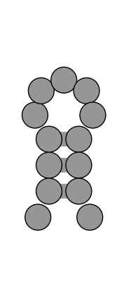
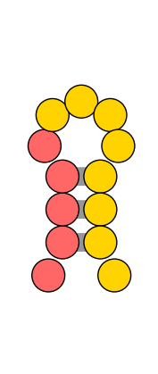

# rna_draw

A minimial python package for drawing nucleic acid secondary structures. 

## Dependencies


## Install

Currently rna_draw requires cairosvg (https://cairosvg.org/) which requires cairo graphics (https://www.cairographics.org/download/) to be installed

```shell
#Mac 
brew install cairo

#ubuntu 
sudo apt-get install libcairo2-dev

#fedora 
sudo yum install cairo-devel

```


## TODO

(1) Large structures still generate collisions. 
(2) draw tertiary contacts 

## Usage

There are two ways to call rna_draw. First is the command line exe that was installed with the package 

```shell
usage: draw_rna.py [-h] -ss SS [-seq SEQ] [-out OUT] [-color_str COLOR_STR]
                   [-data_file DATA_FILE] [-data DATA]
                   [-render_type RENDER_TYPE]

optional arguments:
  -h, --help            show this help message and exit
  -ss SS                secondary structure in dot bracket notation
  -seq SEQ              rna sequence
  -out OUT              output png file
  -color_str COLOR_STR  description of coloring, see docs for options
  -data_file DATA_FILE  path to data to color by
  -data DATA            data values by res seperated by ;
  -render_type RENDER_TYPE
                        scheme to color by options: res_type,paired,motif,none
```

Second import the package and call rna_draw function 

```python
import rna_draw as rd 
rd.rna_draw(ss, seq=None, filename='secstruct', color_str=None,
            render_type=None, data=None, data_palette=None, data_file=None, 
            default_color=None)

```

## How to: 

- [basic usage](#basic-usage)
	- [just secondary structure](#just-secondary-structure)
	- [supplying a sequence](#supplying-a-sequence)
	- [adding render type](#adding-render-type)
	- [second render type example](#second-render-type-example)
	- [supplying custom colors](#supplying-custom-colors)
- [coloring examples](#coloring-examples)
	- [using single color codes](#using-single-color-codes)
	- [changing default color](#changing-default-color)
## basic usage
### just secondary structure
all that is needed is to supply a secondary structure
```shell
rna_draw -ss "((((.....))))" 
```

### supplying a sequence
sequence identity can be supplied through -seq option. Any letter can be supplied.
```shell
rna_draw -ss ".(((.....)))." -seq AUGANNNNNUCAA 
```

### adding render type
can supply a render type to color with a specific style. res_type, colors by residue color.
```shell
rna_draw -ss ".(((.....)))." -seq AUGANNNNNUCAA -render_type res_type 
```

### second render type example
there are different types of render types, here is showing "paired", which colors by whether a residue is in a basepair.
```shell
rna_draw -ss ".(((.....)))." -seq AUGANNNNNUCAA -render_type paired 
```

### supplying custom colors
The user can supply any set of colors as long as they are not overlapping. The format is resnum_min-resnum_max:color. You also do a single resnum in the format resnum:color. In this case we are using single letter codes. The available codes are red (r), greeen (g), blue (b), yellow (y), cyan (c), magenta (m), white (w), gray (e), orange(o)
```shell
rna_draw -ss ".(((.....)))." -seq AUGANNNNNUCAA -color_str 1-5:r;6-13:b 
```

## coloring examples
### using single color codes
using the single color codes its one can specify a color string with the same length as the secondary structure. The available codes are red (r), greeen (g), blue (b), yellow (y), cyan (c), magenta (m), white (w), gray (e), orange(o).
```shell
rna_draw -ss ".(((.....)))." -color_str rrrrbbbbbgggg 
```

### changing default color
if the color string does not cover all residues the default color will be used for the rest. You can change this color.
```shell
rna_draw -ss ".(((.....)))." -color_str 1-5:r -default_color y 
```

