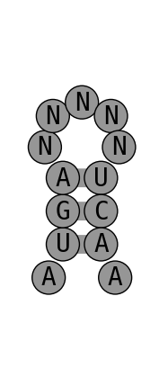
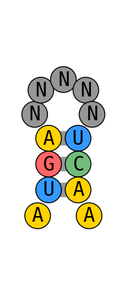
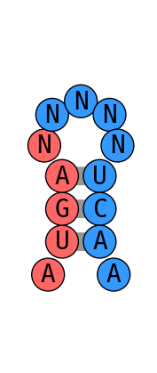
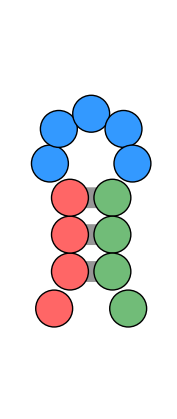
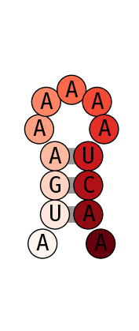
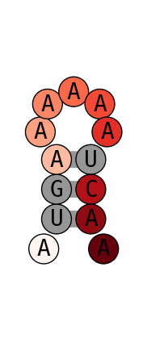
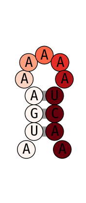

#rna_draw

------

[](https://github.com/psf/black)[](https://travis-ci.com/github/YesselmanLab/rna_draw)


A minimial python package for drawing nucleic acid secondary structures. 

## Install

To install rna_draw 

```shell
python -m pip install git+https://github.com/YesselmanLab/rna_draw.git
```

## TODO

(1) Large structures still generate collisions. 
(2) draw tertiary contacts 

## Usage

There are two ways to call rna_draw. First is the command line exe that was installed with the package There are two ways to call rna_draw. First is the command line exe that was installed with the package 

## How to: 

- [basic usage](#basic-usage)
	- [just secondary structure](#just-secondary-structure)
	- [supplying a sequence](#supplying-a-sequence)
	- [adding render type](#adding-render-type)
	- [second render type example](#second-render-type-example)
	- [supplying custom colors](#supplying-custom-colors)
- [coloring examples](#coloring-examples)
	- [using single color codes](#using-single-color-codes)
	- [changing default color](#changing-default-color)
	- [using xkcd colors](#using-xkcd-colors)
	- [overwriting render type colors](#overwriting-render-type-colors)
- [using experimental data](#using-experimental-data)
	- [basic coloring with data](#basic-coloring-with-data)
	- [ignoring data by restype](#ignoring-data-by-restype)
	- [setting min and max values](#setting-min-and-max-values)
## basic usage
### just secondary structure
all that is needed is to supply a secondary structure
```shell
rna_draw -ss ".(((.....)))." 
```
```python
rd.rna_draw(ss='.(((.....))).')
```

### supplying a sequence
sequence identity can be supplied through -seq option. Any letter can be supplied.
```shell
rna_draw -ss ".(((.....)))." -seq AUGANNNNNUCAA 
```
```python
rd.rna_draw(ss='.(((.....))).', seq='AUGANNNNNUCAA')
```

### adding render type
can supply a render type to color with a specific style. res_type, colors by residue color.
```shell
rna_draw -ss ".(((.....)))." -seq AUGANNNNNUCAA -render_type res_type 
```
```python
rd.rna_draw(ss='.(((.....))).', seq='AUGANNNNNUCAA', render_type='res_type')
```

### second render type example
there are different types of render types, here is showing "paired", which colors by whether a residue is in a basepair.
```shell
rna_draw -ss ".(((.....)))." -seq AUGANNNNNUCAA -render_type paired 
```
```python
rd.rna_draw(ss='.(((.....))).', seq='AUGANNNNNUCAA', render_type='paired')
```

### supplying custom colors
The user can supply any set of colors as long as they are not overlapping. The format is resnum_min-resnum_max:color. You also do a single resnum in the format resnum:color. In this case we are using single letter codes. The available codes are red (r), greeen (g), blue (b), yellow (y), cyan (c), magenta (m), white (w), gray (e), orange(o)
```shell
rna_draw -ss ".(((.....)))." -seq AUGANNNNNUCAA -color_str 1-5:r;6-13:b 
```
```python
rd.rna_draw(ss='.(((.....))).', seq='AUGANNNNNUCAA', color_str='1-5:r;6-13:b')
```

## coloring examples
### using single color codes
using the single color codes its one can specify a color string with the same length as the secondary structure. The available codes are red (r), greeen (g), blue (b), yellow (y), cyan (c), magenta (m), white (w), gray (e), orange(o).
```shell
rna_draw -ss ".(((.....)))." -color_str rrrrbbbbbgggg 
```
```python
rd.rna_draw(ss='.(((.....))).', color_str='rrrrbbbbbgggg')
```

### changing default color
if the color string does not cover all residues the default color will be used for the rest. You can change this color.
```shell
rna_draw -ss ".(((.....)))." -color_str 1-5:r -default_color y 
```
```python
rd.rna_draw(ss='.(((.....))).', color_str='1-5:r', default_color='y')
```

### using xkcd colors
colors can be a mixture of single character codes and xkcd colors (https://xkcd.com/color/rgb/)
```shell
rna_draw -ss ".(((.....)))." -color_str purple;green;blue;pink;brown;red;fuchsia;hunter green;mustard yellow;eggplant;off white;r;r 
```
```python
rd.rna_draw(ss='.(((.....))).', color_str='purple;green;blue;pink;brown;red;fuchsia;hunter green;mustard yellow;eggplant;off white;r;r')
```

### overwriting render type colors
color_str always overrides render type colors, to allow for more flexibility in coloring.d xkcd colors (https://xkcd.com/color/rgb/). Here we changed the color of residue 5 to 9 which would of been gray but instead is aqua blue.
```shell
rna_draw -ss ".(((.....)))." -seq AUGANNNNNUCAA -color_str 5-9:aqua blue -render_type res_type 
```
```python
rd.rna_draw(ss='.(((.....))).', seq='AUGANNNNNUCAA', color_str='5-9:aqua blue', render_type='res_type')
```

## using experimental data
### basic coloring with data
data can be supplied directly using ; to seperate each data point
```shell
rna_draw -ss ".(((.....)))." -seq AUGAAAAAAUCAA -data_str 0;1;2;3;4;5;6;7;8;9;10;11;12 
```
```python
rd.rna_draw(ss='.(((.....))).', seq='AUGAAAAAAUCAA', data_str='0;1;2;3;4;5;6;7;8;9;10;11;12')
```

### ignoring data by restype
Specific data can be ignored if its not applicable. For example G and U for DMS chemical mapping.
```shell
rna_draw -ss ".(((.....)))." -seq AUGAAAAAAUCAA -data_str 0;1;2;3;4;5;6;7;8;9;10;11;12 -data_ignore_restype GU 
```
```python
rd.rna_draw(ss='.(((.....))).', seq='AUGAAAAAAUCAA', data_str='0;1;2;3;4;5;6;7;8;9;10;11;12', data_ignore_restype='GU')
```

### setting min and max values
Can set the min and max value for coloring. Anything below or equal to vmin will be colored as the min value with the palette.
```shell
rna_draw -ss ".(((.....)))." -seq AUGAAAAAAUCAA -data_str 0;1;2;3;4;5;6;7;8;9;10;11;12 -data_vmin 3 -data_vmax 9 
```
```python
rd.rna_draw(ss='.(((.....))).', seq='AUGAAAAAAUCAA', data_str='0;1;2;3;4;5;6;7;8;9;10;11;12', data_vmin=3, data_vmax=9)
```

